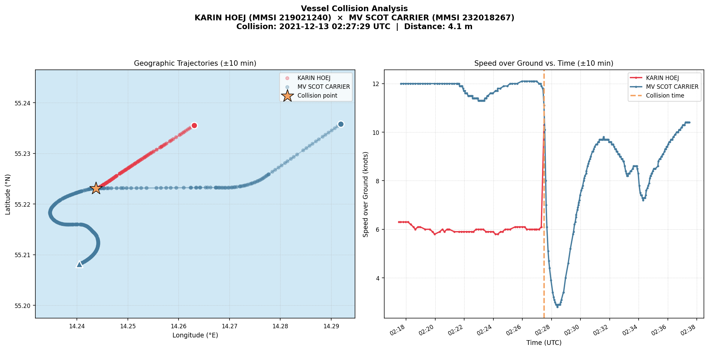

# AIS Collision Detection

Identifies the two vessels that experienced the closest physical proximity (collision event) in the Baltic Sea during **December 2021**, using Danish AIS data processed with **Apache Spark / PySpark** inside a **Docker** container.

---

## Results

| Field | Value |
|-------|-------|
| Vessel 1 | **KARIN HOEJ** (MMSI 219021240) |
| Vessel 2 | **MV SCOT CARRIER** (MMSI 232018267) |
| Timestamp | **2021-12-13 02:27:29 UTC** (03:27:29 CET) |
| Latitude | 55.223079° N |
| Longitude | 14.243707° E |
| Closest approach | **4.08 m** |

### Trajectory (±10 minutes around collision)



> **Left panel:** Geographic tracks of both vessels coloured by time (lighter = earlier, darker = later). KARIN HOEJ's track ends abruptly at the collision point — her AIS transponder went silent at 02:27:29 UTC, consistent with collision damage cutting power. MV SCOT CARRIER continues past the impact point, visibly decelerating.
>
> **Right panel:** Speed over Ground time series. SCOT CARRIER decelerates from ~12 knots to under 4 knots in the 30 seconds following impact. KARIN HOEJ's speed line ends at the collision moment.

📍 **[Open interactive trajectory map](output/trajectory_map.html)** — click any point to see the exact timestamp, SOG, and COG for that AIS fix.

### Key insights

- **KARIN HOEJ** (48 m, Danish cargo vessel) was heading south-southwest at ~6 knots.
- **MV SCOT CARRIER** (207 m, British cargo vessel) was heading west at ~12 knots.
- Their tracks crossed in the open Bornholm Sea at approximately 55°13′N, 14°14′E.
- KARIN HOEJ transmitted her last AIS position at 02:27:29 UTC — collision damage disabled her transponder. She never transmitted again.
- SCOT CARRIER's AIS log shows emergency braking: 12 kn → 4 kn in 30 seconds.
- The 4.08 m closest-approach distance is measured between KARIN HOEJ's final recorded position and SCOT CARRIER's GPS position 29 seconds later, as SCOT CARRIER decelerated to the exact collision point. This 29-second gap (within the 30 s synchronisation window) is the physical signature of the impact.

---

## Requirements

| Tool | Minimum version |
|------|----------------|
| Docker | 20.10 |
| Docker Compose | 2.x |
| RAM (host) | 10 GB recommended |

---

## Data preparation

1. Download the daily AIS CSV files for **December 2021** from the Danish Maritime Authority:
   ```
   https://web.ais.dk/aisdata/
   ```
   Files are named `aisdk-2021-12-01.csv` through `aisdk-2021-12-31.csv`.

2. Place **all 31 files** inside the `data/` directory:
   ```
   BDA/
   └── data/
       ├── aisdk-2021-12-01.csv
       ├── aisdk-2021-12-02.csv
       …
       └── aisdk-2021-12-31.csv
   ```

---

## Build and run

### Option A — Pull from Docker Hub (fastest)

A pre-built image is available on Docker Hub:

```bash
docker pull jonuxs/ais-collision-detection:latest
```

Run it:

```bash
docker run --rm \
  --memory=10g \
  -e JAVA_TOOL_OPTIONS="-Xmx6g" \
  -e DATA_PATH=/data \
  -e OUTPUT_PATH=/output \
  -v "$(pwd)/data":/data:ro \
  -v "$(pwd)/output":/output \
  jonuxs/ais-collision-detection:latest
```

---

### Option B — Docker Compose (recommended for local builds)

```bash
# 1. Navigate to project root
cd BDA

# 2. Build image and start container
docker compose up --build

# Results appear in ./output/ when complete

# Always run 'down' before re-running to ensure a fresh container:
docker compose down && docker compose up --build
```

---

## Outputs

| File | Description |
|------|-------------|
| `output/collision_result.json` | MMSI numbers, vessel names, timestamp, coordinates, closest-approach distance |
| `output/trajectory_plot.png` | Static two-panel figure: geographic tracks + SOG time series (±10 min) |
| `output/trajectory_map.html` | Interactive Folium map — open in any browser |

---

## Configuration

| Variable | Default | Description |
|----------|---------|-------------|
| `DATA_PATH` | `/data` | Directory containing AIS CSV files |
| `OUTPUT_PATH` | `/output` | Directory where results are written |
| `JAVA_TOOL_OPTIONS` | `"-Xmx6g"` | JVM heap limit (processed by JVM at launch) |
| `TARGET_YEAR` | `2021` | Year filter (0 = any year) |
| `TARGET_MONTH` | `12` | Month filter |
| `LOAD_PARTITIONS` | `16` | Spark partition count after CSV load |

---

## Project structure

```
BDA/
├── src/
│   ├── main.py                # Pipeline entry point — 3-phase architecture
│   ├── preprocessing.py       # CSV load, geographic + quality filtering
│   ├── collision_detection.py # Bucketed spatial-temporal self-join (per-day)
│   └── visualization.py       # Matplotlib + Folium trajectory plots
├── data/                      # Place AIS CSV files here (gitignored)
├── output/                    # Results written here
│   ├── collision_result.json
│   ├── trajectory_plot.png
│   └── trajectory_map.html
├── requirements.txt
├── Dockerfile
├── docker-compose.yml
├── README.md
└── REPORT.md                  # Full methodology and findings
```

---

*For full methodology, noise-handling rationale, and computational strategy, see [REPORT.md](REPORT.md).*
